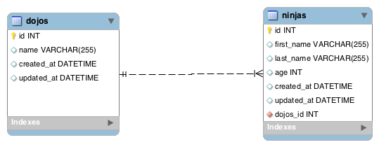
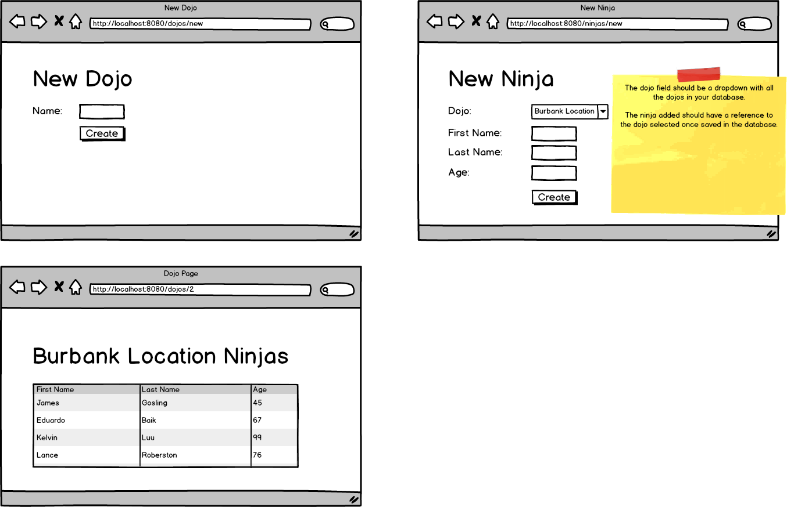
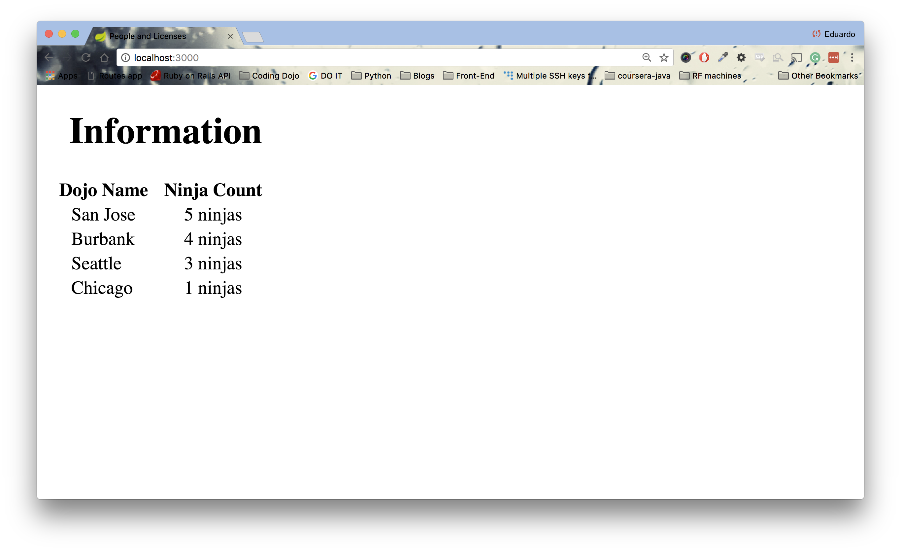

# java_dojosAndNinjas

## Dojo and Ninjas Assignment
In this assignment, you will be creating an application that will keep track of dojos and all the ninjas that are part of a specific dojo.

**ERD and Wireframe**




**Topics:**

● One-To-Many relationships

● JPA

**Tasks:**

● Allow users to create a new dojo.

● Allow new ninjas to choose their dojo via a dropdown

● Have a dojo show page show information of all the ninjas that belong to that specific location.

**.war File**

To test if you have completed this assignment correctly, we have created a project that simply displays all the dojos with the count of all their ninjas.



First download this .war file: [license-0.0.2-SNAPSHOT.war](https://github.com/itzedu/warFiles/raw/master/license-0.0.2-SNAPSHOT.war). Now, you can run ```java -jar license-0.0.2-SNAPSHOT.war``` and it will start this Spring Boot project on port 3000. Visit localhost:3000 and you should see the picture above but with the information of your database. If not, you have added dojo and ninjas incorrectly.